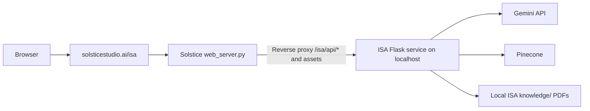

# Hosting ISA Under solsticestudio.ai/isa

This note describes how ISA could be hosted under the existing Solstice public Flask web server at `solsticestudio.ai/isa`. It is not implemented in this repo because deployment should be done deliberately with secrets, process management, and document access policies in place.

## Short Answer

Difficulty: moderate, not hard.

The existing `C:\dev\Solstice-EIM\web_server.py` already has many route and proxy patterns. The safest approach is to run ISA as a separate internal service, then proxy `/isa` and `/isa/*` from the public web server to that service.

This avoids merging two Flask apps and keeps ISA dependencies, environment variables, logs, and document storage isolated.

## Recommended Architecture



## Why Proxy Instead Of Importing ISA Directly?

Proxying is cleaner because:

- ISA has its own Flask app, templates, static files, and config.
- ISA has separate Python dependencies.
- ISA needs its own `.env` and private PDF directory.
- Restarting ISA should not require restarting the public marketing site.
- Public routes can be gated or removed quickly at the proxy layer.
- It avoids route collisions with the existing Solstice app.

## Required ISA Changes For `/isa`

ISA currently assumes it is mounted at the web root. To work cleanly under `/isa`, it should support an app base path.

Useful changes:

1. Add an environment variable:

```env
APPLICATION_ROOT=/isa
ISA_BASE_PATH=/isa
```

2. Make frontend fetches relative to the base path:

```js
fetch(`${window.ISA_BASE_PATH}/api/chat`, ...)
```

3. Generate PDF links with the base path:

```js
`${window.ISA_BASE_PATH}/api/document/...`
```

4. Ensure Flask URL generation respects the prefix when proxied.

A quick proxy can work without these changes if the web server rewrites paths, but base-path support is more reliable.

## Required Solstice Web Server Changes

In `C:\dev\Solstice-EIM\web_server.py`, add a proxy route before catch-all routes:

```python
ISA_SERVICE_URL = os.environ.get("ISA_SERVICE_URL", "http://127.0.0.1:5010")

@app.route("/isa", defaults={"path": ""}, methods=["GET", "POST", "PUT", "DELETE", "OPTIONS"])
@app.route("/isa/<path:path>", methods=["GET", "POST", "PUT", "DELETE", "OPTIONS"])
def isa_proxy(path):
    target = f"{ISA_SERVICE_URL}/{path}"
    # forward method, headers, query string, and body
    # strip or normalize hop-by-hop headers
    # return upstream response
```

The existing web server already has several proxy examples, including API and service proxies. ISA should follow those patterns.

## Process Management

ISA should run as a separate process on localhost, for example:

```powershell
$env:PORT="5010"
python app.py
```

For a real deployment:

- use Waitress or Gunicorn/WSGI depending on host OS
- run it as a service
- restart automatically on failure
- keep logs separate from the public site
- keep `.env` outside Git

## Security Considerations Before Public Exposure

Before exposing `/isa` publicly, decide whether ISA is:

1. a public demo, or
2. a private interview/demo endpoint.

For a private demo, add at least one of:

- basic auth at the web-server/proxy layer
- a secret demo token
- IP allowlist
- Cloudflare Access
- temporary route enabled only during the interview

Do not expose private Inogen PDFs publicly unless there is permission to do so. Source document links would serve PDFs from `knowledge/`, so public hosting needs a document-access policy.

## Estimated Work

### Fast Internal Demo

Time: 1-2 hours.

- Run ISA on localhost port 5010.
- Add `/isa` proxy route to `web_server.py`.
- Add minimal path rewriting if needed.
- Add temporary basic access control.
- Smoke test chat and static assets.

### Clean Public Demo

Time: 0.5-1 day.

- Add base-path support to ISA.
- Add proxy route.
- Add auth/demo gate.
- Add process manager.
- Add health check.
- Confirm no private PDFs are exposed unintentionally.
- Test source links and static assets under `/isa`.

### Production-Grade Deployment

Time: 2-5 days depending on hosting environment.

- Containerize or service-manage ISA.
- Add auth, rate limiting, CSRF, and logging policy.
- Add prompt-injection hardening.
- Add source-document governance.
- Add monitoring and uptime checks.
- Add backup and rollback process.

## Recommendation For The Interview

Do not host the full Inogen-specific assistant publicly before the interview unless you are comfortable exposing the demo and its source document behavior.

The strongest option is:

- keep the GitHub repo public without private PDFs or keys
- run ISA locally for the interview demo
- optionally prepare `/isa` as a private, gated route if a hosted demo becomes necessary

That shows engineering readiness without giving away a production deployment or private documentation setup.
